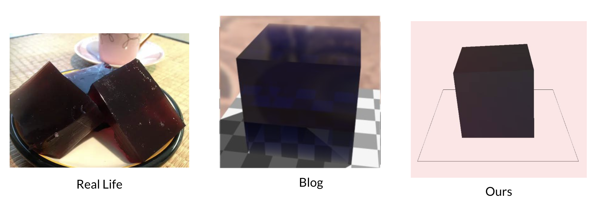

# Jello Simulation Using OpengGL :custard:
By Angel Lam and Varun Ramakrishnan 

source: https://blog.demofox.org/2017/01/09/raytracing-reflection-refraction-fresnel-total-internal-reflection-and-beers-law/

## Implementation 
  - Physically-based Jello Simulation using Mass-Spring System
    - Collision detection and response with the bounding box 
    
      
      
  - Beer's Law 
  - Integration (Euler and Runge-Kutta 4th Order)
  - Optimization with OpenMP
  
 ## Features
  - Cursor to jiggle the jello, acceleration and the direction of the cursor determines the force on the jello 
  - Holding P + shake the cursor to shake the plate that the jello is on 
  - Holding C + left/middle/right mouse to rotate/pan/zoom the camera
  - Edit the color, absorption color, specular color of the jello's material
  - Edit the light color and position 
  - Edit/visualize physics paraeters (jello resolution, spring types, stiffness, damping, mass and timestep)
  
  

  
## Evaluation and Future work
  - Implement per vertex lighting to eliminate triangulated surfaces when the jello has low resolution 
  - Implement skybox or a background that is not a solid color to better visualize the characteristics of the jello's material
  - Speed up simulation by moving it to compute shader (on the GPU)
  - Enable collision with other objects in the bounding box
  - Allow jello to jiggle of the plate 
  
  
